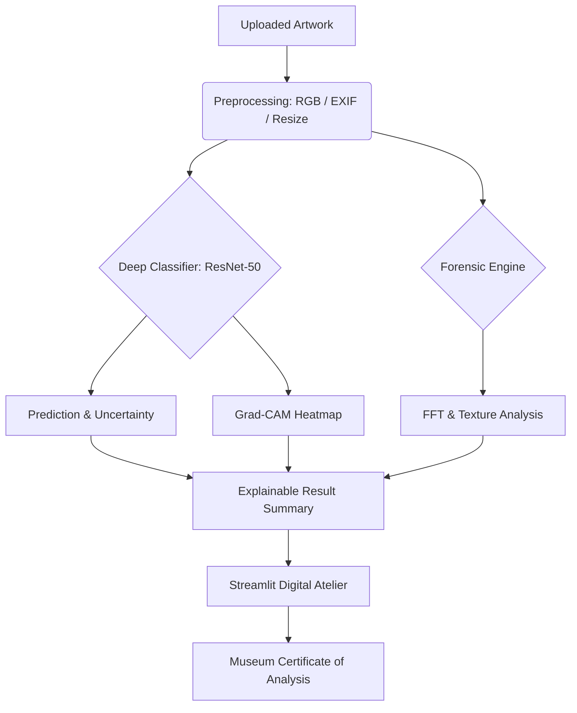

# Canvas Forensics: AI Art Authentication & Synthetic Slop Detection


**Canvas Forensics** is an AI-powered art forensics system and digital atelier. Designed as an academic prototype for Artificial Intelligence and Data Science research, this system analyzes an uploaded painting and classifies it as either **Human-Made / Authentic** or **AI-Generated / Synthetic**.

Unlike traditional binary classifiers, this system prioritizes **Explainable AI (XAI)**, providing visual and heuristic evidence to support its classification, making its decision-making process transparent and scientifically defensible.

---

## 🔬 Core Objectives & Problem Statement

The rapid advancement of generative diffusion models (e.g., Midjourney, Stable Diffusion, DALL-E) has made distinguishing between human-made fine art and synthetic imagery increasingly difficult. This project addresses the challenge of **AI Art Authentication** by combining:

1.  **Deep Learning Classification:** A fine-tuned ResNet-50 backbone.
2.  **Visual Explainability:** Grad-CAM activation heatmaps.
3.  **Heuristic Forensics:** Frequency-domain and texture-based anomaly detection.
4.  **Uncertainty Estimation:** Monte Carlo Dropout for confidence bounds.

This layered approach ensures that the model provides *supporting evidence* rather than just a black-box percentage.

---

## 🏗️ System Architecture

The application pipeline is designed for robustness and interpretability:



### 1. Data Preprocessing (`src/preprocessing.py`)
Robust handling of arbitrary user uploads.
*   **Normalization:** Converts CMYK, RGBA, Grayscale, and Palette modes to standard RGB.
*   **Orientation:** Corrects EXIF rotation metadata.
*   **Tensor Transformation:** Resizes, center-crops, and normalizes using ImageNet statistics (`mean=[0.485, 0.456, 0.406]`, `std=[0.229, 0.224, 0.225]`).

### 2. Deep Classifier (`src/model.py`)
*   **Backbone:** ResNet-50 (pretrained on ImageNet1k_v2), chosen for its established feature-extraction capabilities and hook-compatibility for Grad-CAM.
*   **Fine-tuning:** Custom binary classification head (`0_real`, `1_ai`).
*   **Uncertainty:** Implements a lightweight **Monte Carlo Dropout** (MC-Dropout) during inference. By performing multiple stochastic forward passes, the system calculates a confidence band rather than a naive point estimate.

### 3. Explainable AI: Grad-CAM (`src/gradcam.py`)
*   **Methodology:** Gradient-weighted Class Activation Mapping (Grad-CAM) attaches forward/backward hooks to the final convolutional layer of the backbone (`layer4`).
*   **Purpose:** Visualizes the spatial regions that most strongly influenced the model's prediction (e.g., erratic textures, blurred anatomical edges, or unnatural lighting gradients).

### 4. Forensic Engine (`src/forensics.py`)
Heuristic, model-independent signals that complement the deep classifier.
*   **Frequency-Domain Analysis (2D FFT):** Calculates the ratio of high-frequency spectral energy. Diffusion models often exhibit unnatural smoothness (suppressed high frequencies) or checkerboard artifacts (high-frequency spikes).
*   **Laplacian Variance:** A proxy for micro-texture and edge sharpness. Analyzes the presence of physical media brushwork versus synthetic smoothness.
*   **Local Contrast Distribution:** Evaluates the standard deviation of local contrast patches to detect unusually uniform color gradients typical of synthetic generation.

---

## 📊 Dataset & Training

### Data Sources
The model is trained on a unified dataset combining:
1.  **Curated Academic Dataset:** A proprietary Google Drive dataset containing high-quality traditional art and modern synthetic outputs.
2.  **Public Kaggle Dataset:** `cashbowman/ai-generated-images-vs-real-images` for increased volume and diversity.

### Training Methodology (`train_colab.py`)
*   **Environment:** Designed for Google Colab (GPU).
*   **Optimization:** AdamW optimizer (`lr=3e-4`, `weight_decay=1e-4`) with a Cosine Annealing Learning Rate Scheduler.
*   **Augmentation:** Random Resized Crop, Horizontal Flip, and Color Jitter to prevent overfitting and encourage the model to learn deep structural features rather than superficial color statistics.

---

## 🚀 Installation & Local Execution

### 1. Prerequisites
*   Python 3.10+
*   Git

### 2. Setup
```bash
git clone <repository-url>
cd ai_art_forensics
pip install -r requirements.txt
```

### 3. Model Weights
Run `train_colab.py` in a GPU environment (like Google Colab) to train the model. Place the resulting `authenticity_model.pth` in the `weights/` directory.

### 4. Run the Digital Atelier
```bash
streamlit run app.py
```

---

## 🌐 Zero-Cost Deployment

### Streamlit Community Cloud (Recommended)
1. Push this repository to GitHub.
2. Log into [Streamlit Community Cloud](https://share.streamlit.io).
3. Deploy the app by pointing to `app.py`.
4. **Large Weights:** If `authenticity_model.pth` exceeds GitHub's 100MB limit, host it on the Hugging Face Hub and set the Streamlit Secret:
   `MODEL_HF_REPO = "your-hf-username/repo-name"`

---

## 🛡️ Limitations & Academic Integrity

As an experimental prototype, this system explicitly acknowledges the following limitations:
*   **Domain Shift:** The classifier is bounded by its training distribution. Out-of-Distribution (OOD) uploads (e.g., sketches, abstract 3D renders, or heavily compressed JPEGs) will trigger a "LOW CONFIDENCE" warning.
*   **Heuristic Fallibility:** The forensic heuristics (FFT, Laplacian) are indicative signals, not absolute proof. Highly realistic synthetic images with added synthetic noise can bypass high-frequency checks.
*   **Photographs of Art:** The system analyzes the digital file, not the physical object. High-quality scans of paintings may introduce sensor noise that impacts forensic metrics.

*The "Museum Certificate of Analysis" generated by this tool is an experimental computational report and does not constitute legally binding proof of authorship or copyright.*
